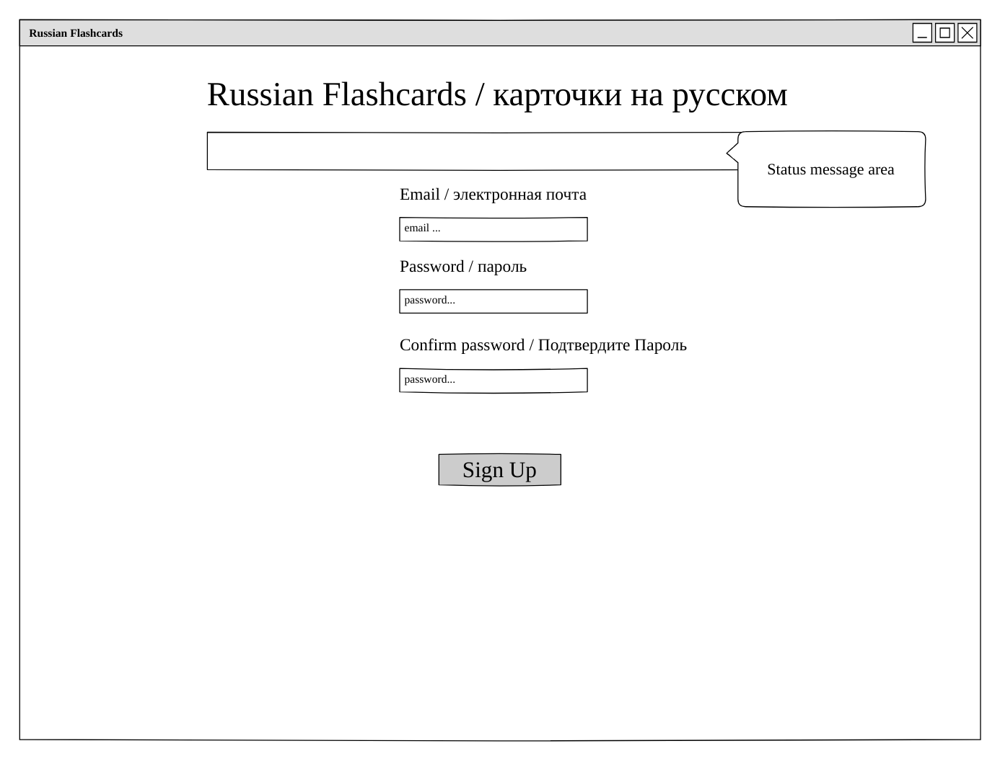

# Russian Flashcards: Description

Free, royalty images found on Bing:

This application allows a user to create, update, delete, and view
flashcards that they create in order to learn Russian vocabulary. 

The Russian Flashcards web application consumes web services from a backend
project completed simultaneoulsy with this project. Its source code may be 
found here:
[Russian flashcards web API Github link](https://github.com/scottlurowist/russian-flashcards-webapi-server)

The application has a web-based front end that communicates with 
a backend web API implemented with Express.js, Mongoose.js, MongoDB, and of 
course Node.js. I implemented the backend. It is deployed to Heroku.

In the initial first version, duplicate flashcards could be generated
since the requirements state that users must own flashcards. If two
different users create a flashcard for the word "car", then obviously
that flashcard would be duplicated in the database. 

The first version of this app tries to be bilingual, but it is slightly
biased toward native English speakers. It uses a Cyrillic soft keyboard
for the mangement of flashcards, but that same keyboard is not used 
for the sign-up, sign-in, and change password pages.

## Planning Story

My initial work was to read and understand the project requirements.

I then used the Pencil wireframing application to create the wireframes seen
later in this document. I also generated the initial user stories.

My first implementation step was to take my index.html from the tic-tac-toe project and 
put it in this project. I then stripped it to just the HTML that represents
the home page, sign-up and sign-in pages, and the change password page. My
focus was to first get these pages working.

I also decided to save styling until all functionality is complete.
I initially had no ideas for styling, and I thought that a dark theme would
not work for this app. I did know that the American and Russian flags are
both red, white, and blue, and I wanted to somehow incorporate that idea 
into the app. So I chose a simple, clean, red, white, and blue color theme.

I was not happy with the project template from tic-tac-toe in that it had
students use the events.js, api.js, and ui.js modules. In my mind, this 
promotes a monolithic, horizontal design versus a vertical design with
respect to functionality and better separation of concerns. I understand
why this was done for pedagogical reasons.

I decided for this project to implement a very crude and lightweight MVC framework.
I used my idea from tic-tac-toe of having a psuedo-state machine to manage views
since the requirements state that the app must be an SPA.

app.js is the entry point of the application. All of the code which I wrote has
its module dependencies in this file and nowhere else. This eliminates the chance
of CommonJS module circular dependencies which I encountered during the tic-tac-toe
project. It also does manual dependency injection for the view controllers, building
the object graph of dependencies. It acts as the "composition root" for the entire
application. Each view controller is injected with an object
that has dependencies, and some of those dependencies in turn have dependencies.
The final act of app.js is to instantiate each view controller and invoking the 
view pseudo-state machine so that the app navigates to the proper view. 

The view controllers register themselves with the view pseudo-state machine. The
registration states the name of the view, it's jQuery selector, and a callback for 
resetting the view. When a view declares it's intent to switch to another view,
the state machine hides all views not to be seen, and shows the view of interest. It
also invokes the resetView method on that view so that it is in pristine condition.

By creating view controllers, each view in the app acts more like a plugin to the
entire app. The pseudo-view state machine would also be simpler; it had too much
knowledge of the entire app. 

I also implemented view controllers for the Cyrillic soft keyboard and the status message
area. All of the other view contoller's constructors that need the keyboard register
a callback function for displaying Cyrillic keyboard keypresses. The Cyrillic keyboard
knows about the keyboard in the view and handles clicks. It decodes each click, and 
invokes each handler in the other view controllers. Those other view controllers know how
to display the keypresses. This follows the Gang of Four Observer Pattern.

The status message area is currently a paragraph, but by creating a view controller for it,
I am now free to change how messages are displayed. Because each view controller invokes a
displayMessage method on the status message view controller, everything is loosely-coupled.
I only need to change a single view controller should I decide to change how messages are
displayed.

I also created webAPI.js in the models folder. I was inspired by the Gang of Four Builder
Pattern to build the jQuery AJAX call based upon arguments to it. Now there is a single
line of call that makes the AJAX call in the entire app, reducing code duplication. 
It allows allows for the open-closed principle.

I also used the more modern async / await syntax to keep the code cleaner and more readable.

I wanted to create a web API service to load the Cyrillic keyboards, since it is replicated
4 times in my HTML. The web service could load the HTML from the Node.js filesystem, and return
it. jQuery could then load it into the DOM. But the project requirements stated that I could
only use a single HTML file, so I scrapped that idea.

I also wanted to write automated tests, but I thought that would be too ambitious given 4
days. I feel naked without automated tests.

***

### User Stories

- As a User I want to sign up so that I may review Russian flashcards.
- As a User I want to sign in once I have created an account so that I may review Russian flashcards.
- As a signed in User I want to change my password so that I can ensure that my account is secure.
- As a signed in User I want to sign out from the app so that my session is closed.
- As a signed in User I want to review a Russian flashcard.
- As a signed in User I want to create a Russian flashcard.
- As a signed in User I want to update a Russian flashcard.
- As a signed in User I want to delete a Russian flashcard.

***

### Technologies Directly Used

- JavaScript
- jQuery
- HTML/CSS/SCSS
- Bootstrap 4 (forms, buttons, color themes)
- Grunt / Webpack

***

### Unsolved Problems

- I have no unsolved problems based upon the requirements given to me.

***

### Nice-to-haves / Technical Debt
* Improve the styling including support for responsive design.
* Eliminate the black background on the Russian flag. I just didn't know how
  to make it transparent.
* Create automated Jest tests.
* Eliminate magic numbers and strings.
* Create base classes for the view controllers. There is a quite a bit of code duplication,
  creating more work should I decide to add more views.
* Reduce the duplication of the Cyrillic keyboard in the HTML.
* Make the flashcard CRUD operation UI elements more usable. For example, the Cyrillic
  keyboard should be disabled / enabled depending upon whether the user is typing
  Russian. My goals were ambitious and I ran out of time to implement such functionality.  
***

#### Wireframes:

