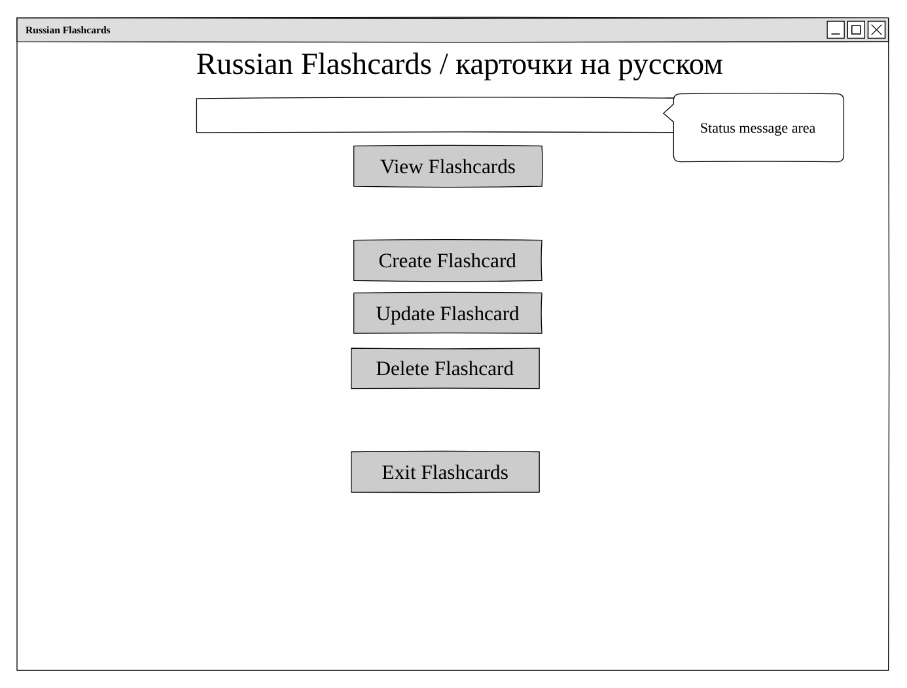
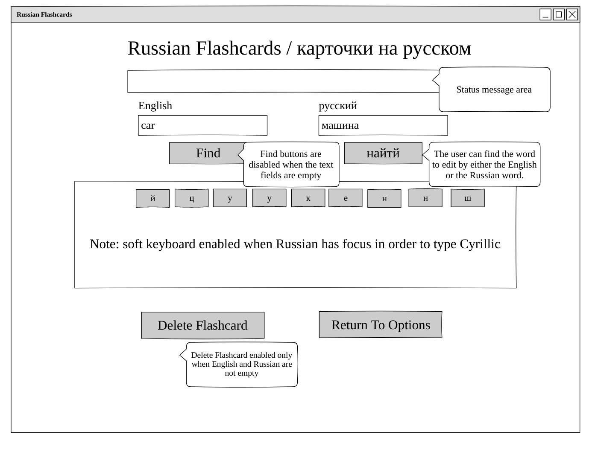

# Russian Flashcards: Description

Free, royalty images found on Bing:

This application allows a user to create, update, delete, and view
flashcards that they create in order to learn Russian vocabulary.

The application has a web-based front end that communicates with 
a backend implemented with Express.js, Mongoose.js, MongoDB, and of 
course Node.js. I implemented the backend.

In the initial first version, duplicate flashcards could be generated
since the requirements state that users must own flashcards. If two
different users create a flashcard for the word "car", then obviously
that flashcard would be duplicated in the database. 

The first version of this app tries to be bilingual, but it is slightly
biased toward native English speakers. It uses a Cyrillic soft keyboard
for the mangement of flashcards, but that same keyboard is not used 
for the sign-up, sign-in, and change password pages.

## Planning Story

My initial work was to read and understand the project requirements.

I then used the Pencil wireframing application to create the wireframes seen
later in this document. I also generated the initial user stories.

My first step was to take my index.html from the tic-tac-toe project and 
put it in this project. I then stripped it to just the HTML that represents
the home page, sign-up and sign-in pages, and the change password page. My
focus was to first get these pages working.

I also decided to save styling until all functionality is complete.
I initially had no ideas for styling, and I thought that a dark theme would
not work for this app. I did know that the American and Russian flags are
both red, white, and blue, and I wanted to somehow incorporate that idea 
into the app.

I was not happy with the project template from tic-tac-toe in that it had
students use the events.js, api.js, and ui.js modules. In my mind, this 
promotes a monolithic, horizontal design, versus a vertical design with
respect to functionality with better separation of concerns. I understand
why this was done for pedagogcal reasons. I decided for this project to 
implement a very crude MVC framework. I used my idea from tic-tac-toe of
having a psuedo state machine to manage views since the requirements state 
that the app must be an SPA. By creating page controllers, each page in the
app acts more like a plugin to the entire app. The pseudo view state machine
would also be simpler; it had too much knowledge of the entire app.  

***

### User Stories

- As a User I want to sign up so that I may review Russian flashcards.
- As a User I want to sign in once I have created an account so that I may review Russian flashcards.
- As a signed in User I want to change my password so that I can ensure that my account is secure.
- As a signed in User I want to sign out from the app so that my session is closed.
- As a signed in User I want to review a Russian flashcard.
- As a signed in User I want to create a Russian flashcard.
- As a signed in User I want to update a Russian flashcard.
- As a signed in User I want to delete a Russian flashcard.

***

### Technologies Directly Used

- JavaScript
- jQuery
- HTML/CSS/SCSS
- Bootstrap 4 (forms, gameboard, buttons)
- Grunt / Webpack

***

### Unsolved Problems

- I have no usolved problems based upon the requirements given to me.

***

### Nice-to-haves / Technical Debt
* Improve the styling including support for responsive design.
***

#### Wireframes:

